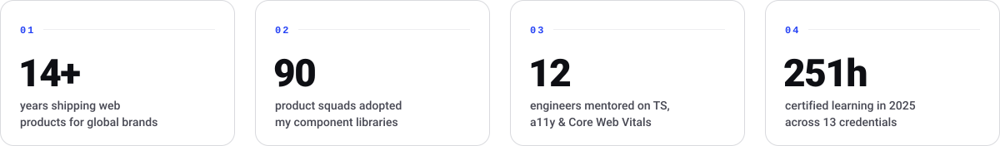

<!--
  Profile README · github.com/oscarenas
  Everything under ./assets is generated. Edit profile.mjs, then run:  node scripts/build.mjs
-->

<picture>
  <source media="(prefers-color-scheme: dark) and (max-width: 600px), (prefers-color-scheme: dark) and (min-width: 768px) and (max-width: 868px)" srcset="assets/hero-mobile-dark.svg">
  <source media="(max-width: 600px), (min-width: 768px) and (max-width: 868px)" srcset="assets/hero-mobile-light.svg">
  <source media="(prefers-color-scheme: dark) and (min-width: 601px) and (max-width: 767px), (prefers-color-scheme: dark) and (min-width: 869px) and (max-width: 1099px)" srcset="assets/hero-tablet-dark.svg">
  <source media="(min-width: 601px) and (max-width: 767px), (min-width: 869px) and (max-width: 1099px)" srcset="assets/hero-tablet-light.svg">
  <source media="(prefers-color-scheme: dark)" srcset="assets/hero-dark.svg">
  
</picture>

  
  <a href="https://resume-oscarenas.web.app"><picture><source media="(prefers-color-scheme: dark)" srcset="assets/btn-resume-dark.svg"></picture></a>
  <a href="https://resume-oscarenas.web.app/cv/oscar-arenas-en.pdf"><picture><source media="(prefers-color-scheme: dark)" srcset="assets/btn-cv-dark.svg"></picture></a>
  <a href="https://www.linkedin.com/in/oscarenas"><picture><source media="(prefers-color-scheme: dark)" srcset="assets/btn-linkedin-dark.svg"></picture></a>
  <a href="mailto:oscarenas@gmail.com"><picture><source media="(prefers-color-scheme: dark)" srcset="assets/btn-email-dark.svg"></picture></a>

¿Prefieres español? La hoja de vida también está en <a href="https://resume-oscarenas.web.app/es">resume-oscarenas.web.app/es</a>.

 

<picture>
  <source media="(prefers-color-scheme: dark) and (max-width: 600px), (prefers-color-scheme: dark) and (min-width: 768px) and (max-width: 868px)" srcset="assets/stats-mobile-dark.svg">
  <source media="(max-width: 600px), (min-width: 768px) and (max-width: 868px)" srcset="assets/stats-mobile-light.svg">
  <source media="(prefers-color-scheme: dark) and (min-width: 601px) and (max-width: 767px), (prefers-color-scheme: dark) and (min-width: 869px) and (max-width: 1099px)" srcset="assets/stats-tablet-dark.svg">
  <source media="(min-width: 601px) and (max-width: 767px), (min-width: 869px) and (max-width: 1099px)" srcset="assets/stats-tablet-light.svg">
  <source media="(prefers-color-scheme: dark)" srcset="assets/stats-dark.svg">
  
</picture>

 

> [!TIP]
> This profile has an agent‑ready twin. [resume‑oscarenas.web.app](https://resume-oscarenas.web.app/#agents) exposes **18 tools** to AI agents through WebMCP (`navigator.modelContext`) — a recruiter's agent can query the profile, filter experience by technology and book an intro call without scraping a single page.

## 01 · About

I build web products that hold up in production — and, lately, the AI layer on top of them. My core stack is **Next.js, Node.js and TypeScript**, on a strong frontend foundation in React, design systems, accessibility (WCAG 2.2) and web performance.

- **AI in production** — LLM‑powered product flows on the OpenAI and Anthropic APIs: conversational and generative features, prompt engineering and structured outputs that behave under real usage. I also use AI every day for coding, review and delivery, without giving up clean architecture.
- **Frontend architecture** — at Publicis Sapient I led the front‑end architecture for Fortune 500 clients and built component libraries adopted across 90 product squads.
- **Leadership** — I lead cross‑functional squads, have mentored 12 engineers on TypeScript, accessibility and Core Web Vitals, and turn ambiguous problems into measurable impact.

| | |
|:--|:--|
| **Now** | Senior Technology Engineer at [Publicis Global Delivery](https://www.publicisglobaldelivery.com/) (Publicis Sapient network) — experience‑led products for retail, finance and telco |
| **Looking for** | Senior / Staff Frontend Engineer · Tech Lead · AI‑augmented product engineer |
| **Work mode** | Remote‑first across LATAM, US and EU time zones · hybrid in Bogotá possible · start in 2–4 weeks |
| **Languages** | Spanish (native) · English (professional working proficiency) |

## 02 · Stack

<picture>
  <source media="(prefers-color-scheme: dark) and (max-width: 600px), (prefers-color-scheme: dark) and (min-width: 768px) and (max-width: 868px)" srcset="assets/stack-mobile-dark.svg">
  <source media="(max-width: 600px), (min-width: 768px) and (max-width: 868px)" srcset="assets/stack-mobile-light.svg">
  <source media="(prefers-color-scheme: dark) and (min-width: 601px) and (max-width: 767px), (prefers-color-scheme: dark) and (min-width: 869px) and (max-width: 1099px)" srcset="assets/stack-tablet-dark.svg">
  <source media="(min-width: 601px) and (max-width: 767px), (min-width: 869px) and (max-width: 1099px)" srcset="assets/stack-tablet-light.svg">
  <source media="(prefers-color-scheme: dark)" srcset="assets/stack-dark.svg">
  
</picture>

<!--
  Hidden for now. To bring it back: remove this comment wrapper and renumber the sections below (03 → 04, …).

## 03 · Things I've built

| Project | What it is | Stack |
|---|---|---|
| [**resume‑oscarenas.web.app**](https://resume-oscarenas.web.app) | Bilingual (EN/ES) resume site with printable PDF/DOCX. It also exposes **18 tools to AI agents** through WebMCP (`navigator.modelContext`) — recruiter agents can query the profile, filter experience and book an intro call. | Astro · Tailwind CSS · TypeScript · Firebase Hosting |
| [**qr.b35tech.com**](https://qr.b35tech.com) | Generator and decoder for **Bre‑B** QR codes (Colombia's instant‑payments system): EMVCo / EASPBV payloads and key handling. | TypeScript · Node.js · Fastify |
| [**b35tech.com**](https://b35tech.com) | Landing for B35Tech — software and AI for small and mid‑sized businesses. | Next.js 16 · React 19 · Tailwind CSS v4 · shadcn/ui |
| [**biciusuario‑react**](https://github.com/oscarenas/biciusuario-react) | Community web app for urban cyclists: shared stats and collaboration around bicycle culture. | React · Firebase |
| [**ecommerce‑api**](https://github.com/oscarenas/ecommerce-api) · [**commerce‑v1**](https://github.com/oscarenas/commerce-v1) | E‑commerce API service and its Next.js storefront. | Node.js · Express · Next.js |

> Most of my recent client work lives in private repositories. Ask me about it — happy to walk through architecture and decisions.
-->

## 03 · Always learning

**251 hours** of certified training in 2025 across 13 credentials — AI & prompt engineering, Node.js, modern frontend, UX with Figma and business validation with LLMs. Full list on my [resume](https://resume-oscarenas.web.app/#certifications).

## 04 · Beyond the keyboard

🚴 Cycling · 🎵 Music · ✈️ Travel · 🎮 Gaming · 🍕 Pizza & craft beer

## 05 · Let's talk

Based in Bogotá (UTC‑5) · intro calls Mon–Fri, 09:00–17:00. Email or LinkedIn is fastest; I'm also on [X](https://twitter.com/oscarenas).

  <a href="mailto:oscarenas@gmail.com"><picture><source media="(prefers-color-scheme: dark)" srcset="assets/btn-email-primary-dark.svg"></picture></a>
  <a href="https://www.linkedin.com/in/oscarenas"><picture><source media="(prefers-color-scheme: dark)" srcset="assets/btn-linkedin-dark.svg"></picture></a>
  <a href="https://resume-oscarenas.web.app"><picture><source media="(prefers-color-scheme: dark)" srcset="assets/btn-resume-dark.svg"></picture></a>

Hand‑built SVG, theme‑aware via <code>&lt;picture&gt;</code> · no third‑party badges, no trackers.

